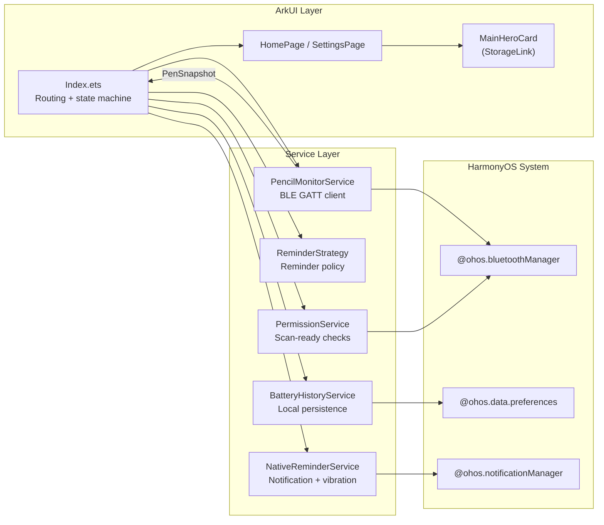
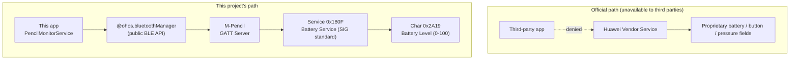

# M-Pencil Battery Guardian

> English | [简体中文](./README.md)

> A third-party ArkTS application on HarmonyOS that reads the real-time battery level of Huawei's M-Pencil stylus and reminds you to detach it before it tops off.


<!-- TODO: Hero GIF — demo of opening the app → auto-connecting to M-Pencil → showing battery percentage, path docs/images/hero.gif -->


---

## What problem it solves

Huawei's official battery API for the M-Pencil is wrapped inside a system-level Vendor Service that is only exposed to first-party apps like Huawei's own "Tablet Assistant" — **no third-party app on the HarmonyOS app market can reliably read M-Pencil's battery level**. The consequence is real: users magnetically attach the pen to the side of the tablet to charge it, and nobody tells them "it's full, you can take it off now" — keeping a lithium cell at 100% on a float charge accelerates aging. This project sidesteps the Vendor Service entirely, talks to the pen over standard BLE GATT, and lets a third-party ArkTS app obtain the real battery value and push threshold-based reminders.

## Key features

| Feature | Description |
|---|---|
| Auto-connect to M-Pencil | On launch, the app scans or reuses already-paired devices and establishes a GATT connection as soon as a candidate pen is identified |
| Threshold reminder + periodic re-reminder | Fires immediately when the configured percentage is reached; optionally re-fires every N minutes until the pen is detached |
| 30-day battery history | Battery samples are persisted locally and viewable across 24h / 7d / 30d windows |

<!-- TODO: Three side-by-side screenshots, path docs/images/features.png — 1) home page real-time battery ring 2) threshold settings 3) history chart -->


## Architecture



`Index.ets` is the central orchestrator: it owns every service, folds the `PenSnapshot` emitted by `PencilMonitorService` into an `AppStatusModel` via `buildNextStatus`, and writes it into `AppStorage`; UI components subscribe to those keys one-way with `@StorageLink`, so Bluetooth state is never bound directly into the component tree.

---

## Technical highlights

### 1. Bypassing Huawei's Vendor Service (core)

**The problem**: Huawei routes the M-Pencil's battery level, custom-button events, pressure data, and so on through a proprietary Vendor channel that is only exposed to system-level first-party apps like the "Smart Assistant" / "Tablet Assistant" — no third-party app gets the battery field, no matter which official SDK it calls. Search "M-Pencil battery" on the HarmonyOS app market and you'll find either apps that can only show "connected / disconnected" as a two-state indicator, or wrappers around an illustrated how-to guide; not a single one actually produces a real percentage. That is exactly why this project has to exist: **the official path is fenced off, so a third party has to find a way around the fence**.

**Investigation and reasoning**: If the M-Pencil shows up as a Bluetooth stylus in the system Bluetooth settings, it must implement the Bluetooth SIG GAP/GATT stack; and Bluetooth SIG's Battery Service 1.0 mandates that any device advertising Battery Service `0x180F` must contain the Battery Level characteristic `0x2A19`, whose value is a single byte from 0 to 100 representing the percentage. HarmonyOS's `@ohos.bluetoothManager` module exposes the full BLE central-role API (`startBLEScan` / `createGattClientDevice` / `getServices` / `readCharacteristicValue`) to third-party apps and does **not** whitelist-filter `0x180F`. **The Vendor channel is locked down; the standard channel is not** — that is the way in.

**The approach**: Don't touch any Huawei-proprietary SDK at all. Treat the M-Pencil like any other generic BLE peripheral.

1. **Device identification**: First walk the paired-device list and double-match against a name whitelist (`'m-pencil' / 'huawei m-pencil' / 'mpencil'`) plus the Bluetooth class-of-device `PERIPHERAL_DIGITAL_PEN`; if nothing matches, fall back to an active `BLEDeviceFind` scan and stop-scan-then-connect the moment a candidate appears, so the radio isn't left running and burning battery. See [`entry/src/main/ets/services/PencilMonitorService.ets:193-208`](entry/src/main/ets/services/PencilMonitorService.ets#L193-L208) (`tryConnectMatchedPairedDevice`) and [`PencilMonitorService.ets:271-301`](entry/src/main/ets/services/PencilMonitorService.ets#L271-L301) (`handleScanResults`).
2. **GATT connection**: Build a GATT client via `bluetoothManager.BLE.createGattClientDevice` and subscribe to `BLEConnectionStateChange` to wait for the real connect event — see [`PencilMonitorService.ets:303-341`](entry/src/main/ets/services/PencilMonitorService.ets#L303-L341). This is where half a day disappeared into one pitfall: HarmonyOS's `connect()` returns before the link is actually up, so you must wait for the callback to deliver `STATE_CONNECTED` **and then sleep 250ms** before calling `getServices`, otherwise you get back an empty service list ([`PencilMonitorService.ets:357-360`](entry/src/main/ets/services/PencilMonitorService.ets#L357-L360)).
3. **Service discovery + battery read**: In `bootstrapBatteryChannel`, enumerate every service, match `0x180F` → `0x2A19` against UUIDs normalized (lowercase, dashes stripped), then call `readCharacteristicValue` and take the first byte as the percentage; in parallel, try `setNotifyCharacteristicChanged` to subscribe to push updates, and if that fails, gracefully degrade to a 5-second polling loop. See [`PencilMonitorService.ets:381-432`](entry/src/main/ets/services/PencilMonitorService.ets#L381-L432) and the constants at [`PencilMonitorService.ets:58-59`](entry/src/main/ets/services/PencilMonitorService.ets#L58-L59).
4. **Inferring charge state**: The standard BLE Battery Service has no "is charging" field (that one only exists on the Vendor channel), so the code infers direction from sample-over-sample delta — current reading higher than the previous one → charging, otherwise discharging; on the very first read with no history, it falls back to `BatteryHistoryService.getMinLevelWithin(30min)` as the baseline. See `consumeBatteryLevel` / `resolveBaselineLevel` at [`PencilMonitorService.ets:471-525`](entry/src/main/ets/services/PencilMonitorService.ets#L471-L525).



**Trade-offs and honest disclaimers**: The standard BLE Battery Service will never tell you "this device is charging right now" — that single bit lives only on the Vendor channel. This project infers charge state from sample direction, which means **the very first reading after a connect cannot tell charging from discharging; you have to wait for the second reading (5 seconds later) to get a direction**; and if the screen has been off for 30+ minutes with no battery samples in that window, the baseline fallback also goes stale. That's the price of bypassing the Vendor channel — but compared with "can't read the battery at all", it's a trade-off worth taking. Error code `2900099` (characteristic operation rejected by the system) is also explicitly mapped to a "Battery read blocked" message shown to the user — [`PencilMonitorService.ets:456-459`](entry/src/main/ets/services/PencilMonitorService.ets#L456-L459).

### 2. Reminder policy: one-shot vs. periodic re-reminder

When the pen is charging the user is likely to walk away from the tablet, so a single notification is easy to miss. `ReminderStrategy` uses a `cycleArmed` flag to distinguish the two semantics — "one-shot delivery" and "keep nagging":

- **One-shot delivery**: Fires once when the level crosses up through the threshold (`crossedThreshold`), or fires once on app launch if the level is already above the threshold (`alreadyAtThreshold`), then immediately flips `cycleArmed` to false — see [`entry/src/main/ets/services/ReminderStrategy.ets:23-35`](entry/src/main/ets/services/ReminderStrategy.ets#L23-L35).
- **Periodic re-reminder**: Only active when the user explicitly enables `repeatReminderEnabled`; throttled by `repeatReminderInterval` minutes and **keeps firing as long as the level stays above the threshold** — see [`ReminderStrategy.ets:37-47`](entry/src/main/ets/services/ReminderStrategy.ets#L37-L47).
- **Reset rules**: Whenever the pen disconnects or charging stops (`isCharging` flips to false), `resetCycle()` re-arms `cycleArmed` — see [`ReminderStrategy.ets:14-21, 56-59`](entry/src/main/ets/services/ReminderStrategy.ets#L14-L21) — so the next charge starts a fresh reminder cycle and you never get a "plug it back in and it instantly buzzes again" experience.

`evaluate()` returns a `ReminderDecision` instead of firing notifications directly; `Index.ets` decides whether to forward it to `NotificationService`. The strategy layer is side-effect-free, which makes it unit-testable and leaves room for additional policies like "quiet hours" later.

### 3. Responsive layout + state/view separation

A HarmonyOS app has to run on both phones and tablets — the same ArkUI code has to adapt between a narrow portrait phone screen and a wide landscape tablet:

- **Width-tiered token output**: `getResponsiveTokens(pageWidth)` in [`entry/src/main/ets/models/UiTokens.ets:29-117`](entry/src/main/ets/models/UiTokens.ets#L29-L117) buckets the width into ≥1240 / ≥900 / <900 tiers and emits 20+ tokens for font sizes, corner radii, padding, battery-ring size, button heights, and more in one place; component code only reads tokens and never branches on width itself.
- **Capped content width + adaptive gutters**: On a landscape tablet the page does not stretch to a 1600px slab — it's clamped to between 960 and 1320px and the remaining space is split evenly via `getSidePadding()`. See [`pages/HomePage.ets:21-24`](entry/src/main/ets/pages/HomePage.ets#L21-L24) and [`pages/SettingsPage.ets:27-30`](entry/src/main/ets/pages/SettingsPage.ets#L27-L30). `Index.ets` reads the screen's physical pixels in `aboutToAppear` via `display.getDefaultDisplaySync()` and converts to logical width using the DPI ([`pages/Index.ets:809-819`](entry/src/main/ets/pages/Index.ets#L809-L819)).
- **State flattened into AppStorage**: Every field the UI needs to render (battery percentage copy, Hero status text, whether retry is enabled, …) is computed and written into `AppStorage` from one place — `syncAppViewState` in [`models/AppViewStorage.ets:62-85`](entry/src/main/ets/models/AppViewStorage.ets#L62-L85). UI components such as [`components/MainHeroCard.ets:6-13`](entry/src/main/ets/components/MainHeroCard.ets#L6-L13) only subscribe one-way through `@StorageLink` and **hold zero Bluetooth or battery state of their own**. That way the component tree doesn't re-render off a whole state-machine update — it only re-renders the specific keys it subscribed to.

<!-- TODO: Portrait vs. landscape comparison screenshot, path docs/images/responsive.png — portrait on the left, landscape on the right -->


---

## Local development

**Prerequisites**: DevEco Studio 3.1+, HarmonyOS SDK API 9, a Huawei tablet that has already been paired with an M-Pencil (tablet / phone device types only — see [`entry/src/main/module.json5:7-10`](entry/src/main/module.json5#L7-L10)).

```powershell
# From the repository root
hvigorw clean
hvigorw assembleHap
```

Or just open the root in DevEco Studio and hit Run. The signing config lives in `build-profile.json5`; you'll need to swap the debug certificate paths to point at your own `.ohos/config/auto_debug_*.cer/p7b/p12`.

On first launch the app requests five permissions — Bluetooth use / Bluetooth scan / precise location / approximate location / vibration. The actual purpose of each permission and where it's declared can be found in [`entry/src/main/module.json5:14-65`](entry/src/main/module.json5#L14-L65) and [`services/PermissionService.ets:75-105`](entry/src/main/ets/services/PermissionService.ets#L75-L105).
