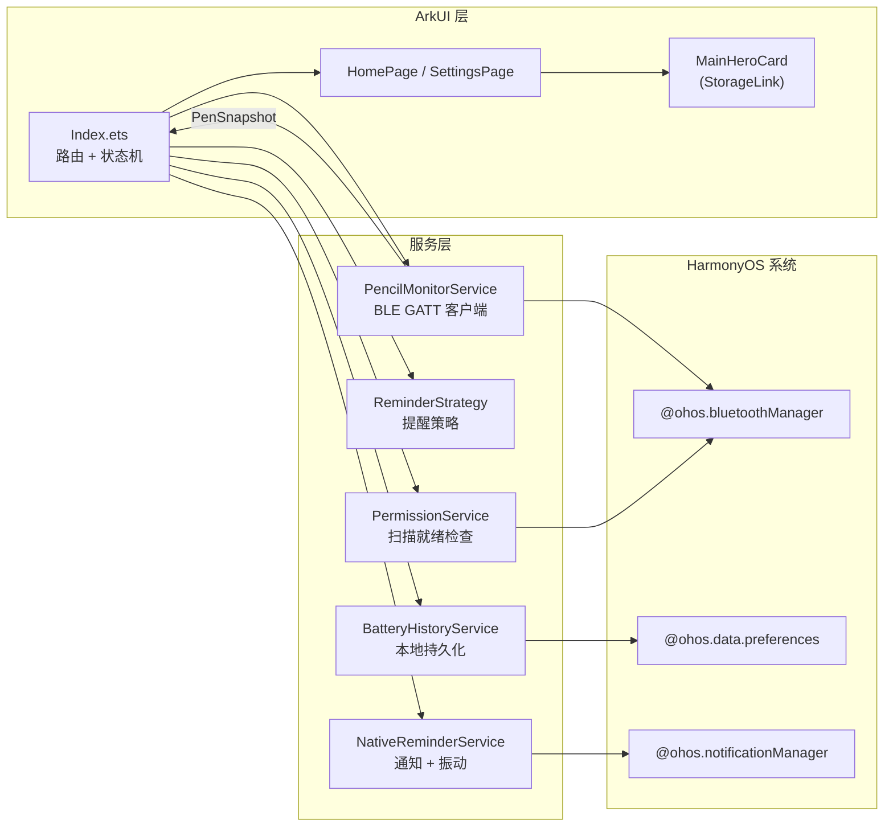
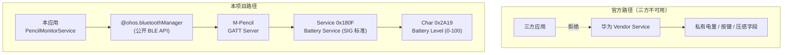

# M-Pencil 护电助手

> [English](./README.en.md) | 简体中文

> 鸿蒙 (HarmonyOS) 上读取华为 M-Pencil 触控笔实时电量并在充满前提醒取下的三方 ArkTS 应用。


<!-- TODO: Hero GIF — 演示打开应用 → 自动连接 M-Pencil → 显示电量百分比，路径 docs/images/hero.gif -->


---

## 它解决什么问题

华为 M-Pencil 的官方电量接口被封装在系统 Vendor Service 中，只对华为自家"平板助手"等一方应用开放，**鸿蒙应用市场里没有任何三方应用能稳定读取 M-Pencil 电量**。结果是：用户把笔吸附到平板侧边充电，没人提醒"已经充满，可以取下了"——锂电池长期满电浮充会加速老化。这个项目绕开了 Vendor Service，通过标准 BLE GATT 直连方案，让一个三方 ArkTS 应用拿到真实电量值并按阈值推送提醒。

## 核心特性

| 特性 | 说明 |
|---|---|
| 自动连接 M-Pencil | 启动后自动扫描或复用已配对设备，识别到候选笔后自动建立 GATT 连接 |
| 阈值提醒 + 周期重提醒 | 充到设定百分比立即通知；可选每 N 分钟重复提醒直到取下 |
| 30 天电量历史 | 本地持久化电量样本，支持 24h / 7d / 30d 三档查看 |

<!-- TODO: 三张并排截图，路径 docs/images/features.png — 1) 主页实时电量环 2) 阈值设置 3) 历史曲线 -->


## 技术架构



`Index.ets` 是中央编排者：它持有所有服务，把 `PencilMonitorService` 推上来的 `PenSnapshot` 经 `buildNextStatus` 折叠成 `AppStatusModel`，再写入 `AppStorage`；UI 组件用 `@StorageLink` 单向订阅这些键，避免把蓝牙状态直接绑进组件树。

---

## 技术亮点

### 1. 绕过华为 Vendor Service 的限制（核心）

**问题**：华为对 M-Pencil 的电量、自定义按键、压感等数据走的是一条私有 Vendor 通道，只暴露给系统级的"智慧助手"/"平板助手"等一方应用——三方应用调用任何官方 SDK 都拿不到电量字段。鸿蒙应用市场里搜"M-Pencil 电量"得到的结果，要么只能显示"已连接/未连接"两态，要么是套了壳的图文教程，没有任何一个能跑出真实百分比。这也是为什么需要这个应用：**官方做了围栏，三方需要找另一条路绕进去**。

**调研推理**：M-Pencil 既然以蓝牙手写笔的身份出现在系统蓝牙设置里，它就一定实现了 Bluetooth SIG 的 GAP/GATT 协议栈；而 Bluetooth SIG 的 Battery Service 1.0 规定，但凡声明 Battery Service `0x180F` 的设备，必须包含 Battery Level characteristic `0x2A19`，且这个 characteristic 的值就是 0-100 的单字节百分比。鸿蒙的 `@ohos.bluetoothManager` 模块对三方应用开放了完整的 BLE 中心设备 API（`startBLEScan` / `createGattClientDevice` / `getServices` / `readCharacteristicValue`），并未对 `0x180F` 做白名单过滤。**Vendor 通道封了，标准通道没封**——这就是切入点。

**方案**：完全不走任何华为私有 SDK，把 M-Pencil 当成一个普通 BLE 外设处理。

1. **设备识别**：先扫已配对设备表，按名称白名单（`'m-pencil' / 'huawei m-pencil' / 'mpencil'`）以及蓝牙类标 `PERIPHERAL_DIGITAL_PEN` 双重匹配；扫不到再回退到 `BLEDeviceFind` 主动扫描，命中候选立即停扫连接，避免长时间扫描耗电。见 [`entry/src/main/ets/services/PencilMonitorService.ets:193-208`](entry/src/main/ets/services/PencilMonitorService.ets#L193-L208) (`tryConnectMatchedPairedDevice`) 和 [`PencilMonitorService.ets:271-301`](entry/src/main/ets/services/PencilMonitorService.ets#L271-L301) (`handleScanResults`)。
2. **GATT 连接**：通过 `bluetoothManager.BLE.createGattClientDevice` 建立 GATT 客户端，订阅 `BLEConnectionStateChange` 等待真实 connect 事件 —— 见 [`PencilMonitorService.ets:303-341`](entry/src/main/ets/services/PencilMonitorService.ets#L303-L341)。这里埋了大半天的一个坑：鸿蒙 `connect()` 返回时连接还没建好，必须等回调到 `STATE_CONNECTED` 后再延迟 250ms 才能 `getServices`，否则会拿到空服务列表（[`PencilMonitorService.ets:357-360`](entry/src/main/ets/services/PencilMonitorService.ets#L357-L360)）。
3. **服务发现 + 电量读取**：在 `bootstrapBatteryChannel` 里枚举所有服务，按标准化后的 UUID（去掉 `-` 转小写）匹配 `0x180F` → `0x2A19`，拿到 characteristic 后 `readCharacteristicValue` 取首字节作为电量；同时尝试 `setNotifyCharacteristicChanged` 订阅推送，失败则降级为 5 秒一次的轮询。见 [`PencilMonitorService.ets:381-432`](entry/src/main/ets/services/PencilMonitorService.ets#L381-L432) 和常量定义 [`PencilMonitorService.ets:58-59`](entry/src/main/ets/services/PencilMonitorService.ets#L58-L59)。
4. **充电态推断**：标准 BLE Battery Service 没有"是否在充电"字段（Vendor 通道才有），所以代码用电量变化方向反推——本次读数高于上一次 → 判定充电中，反之放电；首次读取时如果没有历史样本，会回退到 `BatteryHistoryService.getMinLevelWithin(30min)` 作为基线。见 [`PencilMonitorService.ets:471-525`](entry/src/main/ets/services/PencilMonitorService.ets#L471-L525) 的 `consumeBatteryLevel` / `resolveBaselineLevel`。



**代价与诚实声明**：标准 BLE Battery Service 不会告诉你"正在充电"——这一位字段只存在于 Vendor 通道。本项目用电量变化方向反推充电态，因此**刚连上的第一次读数无法判定是充是放，要等第二次读数（5 秒后）才有方向**；如果息屏后 30 分钟内没有过电量样本，基线回退也会失效。这是绕过 Vendor 的代价，但相比"完全读不到电量"，是可以接受的权衡。错误码 `2900099`（characteristic 操作被系统拒绝）也会被显式映射成"Battery read blocked"提示用户—— [`PencilMonitorService.ets:456-459`](entry/src/main/ets/services/PencilMonitorService.ets#L456-L459)。

### 2. 提醒策略：一次触达 vs 周期重提醒

充电场景下用户可能离开平板，单发一次通知容易被错过。`ReminderStrategy` 用一个 `cycleArmed` 状态位区分"触达"和"持续提醒"两种语义：

- **一次触达**：从低于阈值跨越到达阈值的瞬间触发一次（`crossedThreshold`），或应用启动时已经在阈值之上也触发一次（`alreadyAtThreshold`），然后立即把 `cycleArmed` 设为 false——见 [`entry/src/main/ets/services/ReminderStrategy.ets:23-35`](entry/src/main/ets/services/ReminderStrategy.ets#L23-L35)。
- **周期重提醒**：仅在用户显式开启 `repeatReminderEnabled` 时生效，按 `repeatReminderInterval` 分钟节流，**只要还在阈值之上就持续触发**——见 [`ReminderStrategy.ets:37-47`](entry/src/main/ets/services/ReminderStrategy.ets#L37-L47)。
- **复位规则**：一旦断连或拔出充电（`isCharging` 变 false），`resetCycle()` 把 `cycleArmed` 重新打开——见 [`ReminderStrategy.ets:14-21, 56-59`](entry/src/main/ets/services/ReminderStrategy.ets#L14-L21)，保证下次充电是一个全新的提醒周期，不会出现"插上就立刻又响"的问题。

`evaluate()` 返回 `ReminderDecision` 而不直接触发通知，由 `Index.ets` 决定要不要把它落到 `NotificationService`——策略层零副作用，便于做单元测试和后续接入"勿扰时段"之类的新策略。

### 3. 响应式布局 + 状态视图分离

鸿蒙应用既要跑手机也要跑平板，竖屏窄屏和横屏宽屏的同一份 ArkUI 代码必须自适应：

- **按宽度分档输出 token**：[`entry/src/main/ets/models/UiTokens.ets:29-117`](entry/src/main/ets/models/UiTokens.ets#L29-L117) 的 `getResponsiveTokens(pageWidth)` 把宽度分成 ≥1240 / ≥900 / <900 三档，集中输出字号、圆角、内边距、电量环大小、按钮高度等 20+ 个 token，组件层只读 token 不做条件判断。
- **内容宽度封顶 + 自适应留白**：平板横屏下页面不会拉到 1600px 满宽，而是把内容钳在 960-1320px 之间，剩余空间用 `getSidePadding()` 平均留白——见 [`pages/HomePage.ets:21-24`](entry/src/main/ets/pages/HomePage.ets#L21-L24)、[`pages/SettingsPage.ets:27-30`](entry/src/main/ets/pages/SettingsPage.ets#L27-L30)。`Index.ets` 在 `aboutToAppear` 里通过 `display.getDefaultDisplaySync()` 读取屏幕物理像素并按 DPI 换算成逻辑宽度（[`pages/Index.ets:809-819`](entry/src/main/ets/pages/Index.ets#L809-L819)）。
- **状态扁平化进 AppStorage**：所有要给 UI 看的字段（电量百分比文案、Hero 状态文本、是否可重试…）在 [`models/AppViewStorage.ets:62-85`](entry/src/main/ets/models/AppViewStorage.ets#L62-L85) 的 `syncAppViewState` 里统一计算并写入 `AppStorage`；UI 组件如 [`components/MainHeroCard.ets:6-13`](entry/src/main/ets/components/MainHeroCard.ets#L6-L13) 只通过 `@StorageLink` 单向读取，**不持有任何蓝牙/电量状态**。这样组件树不需要重渲染整个状态机，只有它订阅的具体 key 变了才更新。

<!-- TODO: 横竖屏对比截图，路径 docs/images/responsive.png —— 左竖屏 / 右横屏 -->


---

## 本地开发

**前置**：DevEco Studio 3.1+，HarmonyOS SDK API 9，一台已配对 M-Pencil 的华为平板（仅平板/手机设备类型，见 [`entry/src/main/module.json5:7-10`](entry/src/main/module.json5#L7-L10)）。

```powershell
# 在仓库根目录
hvigorw clean
hvigorw assembleHap
```

或直接用 DevEco Studio 打开根目录后点击 Run。签名配置在 `build-profile.json5`，调试证书路径需要替换成自己的 `.ohos/config/auto_debug_*.cer/p7b/p12`。

首次运行会请求蓝牙使用 / 蓝牙扫描 / 精确位置 / 近似位置 / 振动五项权限——这些权限的真正用途和声明位置见 [`entry/src/main/module.json5:14-65`](entry/src/main/module.json5#L14-L65) 与 [`services/PermissionService.ets:75-105`](entry/src/main/ets/services/PermissionService.ets#L75-L105)。
